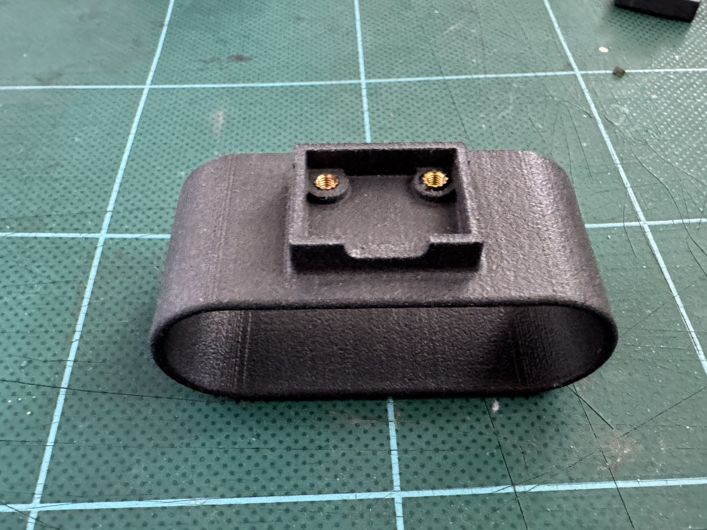
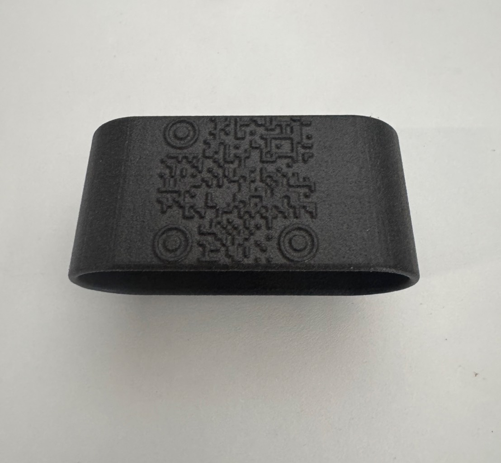
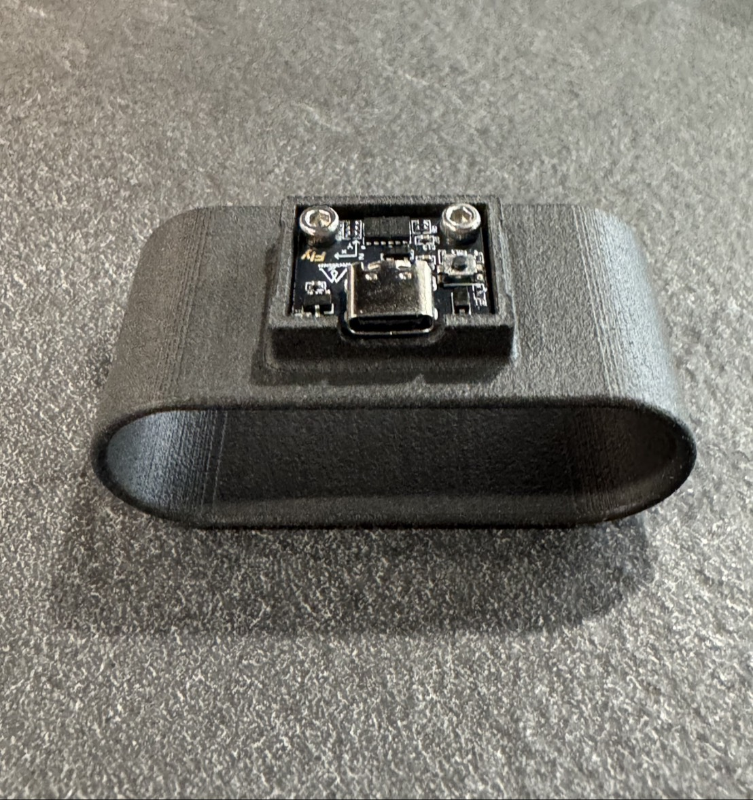
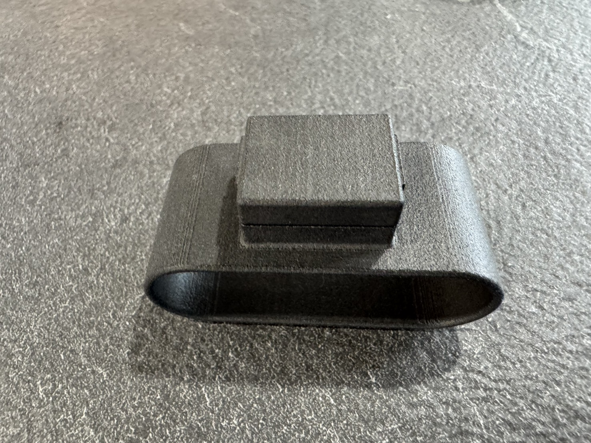

# Mellow Fly-ADXL345 Finger Mount

A finger-worn mounting bracket for the **Mellow Fly-ADXL345 Accelerometer**, designed for resonance measurement with Klipper Input Shaping. Manufactured via **SLS (Selective Laser Sintering)** with Nylon PA12.

## Photos

| Bottom | QR Code | Assembled | Top |
|--------|---------|-----------|-----|
|  |  |  |  |

## Design Features

### Brass Heat Insert
Two brass heat inserts are embedded into the sensor pocket, providing durable metal threads for repeated assembly and disassembly — compensating for Nylon's tendency to strip plastic threads under frequent use.

### Embossed QR Code
A QR code is embossed directly onto the surface of the bracket during the CAD stage, eliminating the need for adhesive labels that can peel off.

### Snap Lock
A cantilever snap lock mechanism allows the top cover to be attached and removed without tools. Pressing the arm releases the lock; releasing snaps it back into position.

## Why SLS

All three features take direct advantage of SLS process characteristics:

- **Snap lock** — The cantilever arm prints without support because surrounding powder acts as natural support. FDM would require a wider clearance gap due to layer bonding and wall swelling.
- **Embossed QR code** — SLS resolution is high enough to reproduce fine QR code geometry cleanly on a curved surface without layer line artifacts.
- **Heat insert** — Standard practice; heat inserts are compatible with any process, but Nylon PA12 from SLS bonds especially well after heating.

This design follows **Design for Manufacturing (DFM)** principles — every feature is optimized for SLS rather than adapted from another process.

## Bill of Materials

| Part | Qty | Note |
|------|-----|------|
| SLS Nylon PA12 bracket (bottom) | 1 | `ด้านล่าง.f3z` |
| SLS Nylon PA12 bracket (top) | 1 | `ด้านบน.f3d` |
| Brass heat insert M2 (OD 3.5 mm) | 2 | Press-fit with soldering iron |
| M2 screw | 2 | For securing ADXL345 PCB |
| Mellow Fly-ADXL345 | 1 | Accelerometer board |

## Print Recommendations

- **Process:** SLS (recommended), FDM possible with wider snap clearance
- **Material:** Nylon PA12
- **Orientation:** Finger loop horizontal to bed
- **No supports required** for SLS

## File Structure

```
├── CAD/
│   ├── ด้านบน.f3d       # Top cover (Fusion 360)
│   └── ด้านล่าง.f3z     # Bottom finger ring with sensor pocket (Fusion 360 archive)
├── Images/
│   ├── S__140730383_0.jpg
│   ├── S__140730384_0.jpg
│   ├── S__140730385_0.jpg
│   └── S__140730386_0.jpg
└── README.md
```
